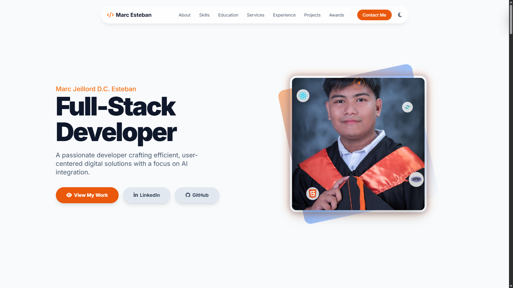

# Marc Jeillord Dela Cruz Esteban's Personal Portfolio

 

[cite_start]I am a Full-Stack Web Developer with 3 years of experience building scalable web applications and business solutions. [cite: 5] [cite_start]My expertise lies in using PHP, MySQL, JavaScript, Tailwind CSS, and the MERN stack to create responsive, user-friendly platforms. [cite: 5] [cite_start]I have a proven ability to deliver clean, maintainable code and develop solutions—including integrating Google Gemini AI—that enhance business efficiency. [cite: 6, 7]

---

## 🛠️ Core Technologies & Skills

[cite_start]My technical skills include a range of modern technologies for front-end and back-end development. [cite: 8]

| Category | Technologies |
| :--- | :--- |
| **Frontend** |      |
| **Backend** |     |
| **Databases** |   |
| **Dev Tools** |   |

---

## 🚀 Key Projects & Experience

Below are highlights of my professional and academic work, showcasing my ability to build comprehensive, real-world applications.

### [cite_start]AI-Powered Dermatology Support System (Capstone Project) [cite: 32]
[cite_start]A clinic management and diagnostic support system developed for DermaSculpt Clinic. [cite: 33]
- [cite_start]**Integrated Google Gemini AI** to provide patient support and Al-assisted clinical insights. [cite: 33, 34]
- [cite_start]Built key features like appointment scheduling, patient booking and communication, and symptom progress tracking. [cite: 34]

### [cite_start]RB Fireworks E-commerce Platform [cite: 28]
[cite_start]A fully functional online store built to handle product catalogs, sales, and user management. [cite: 30]
- [cite_start]Implemented core e-commerce features including a shopping cart, wishlist, secure checkout, and user authentication. [cite: 30, 31]
- [cite_start]Included an integrated order tracking system and an optimized, mobile-responsive UI. [cite: 31]

### [cite_start]Inventory Management & POS System [cite: 13]
[cite_start]A comprehensive system created for M5B Hardware to streamline operations. [cite: 11]
- [cite_start]Built with HTML, PHP, CSS, JavaScript, and MySQL. [cite: 14]
- [cite_start]Successfully improved inventory tracking and sales processing, which decreased manual data entry errors by 40%. [cite: 15]

---

### About This Portfolio Project

This repository contains the code for my personal portfolio, which was built to demonstrate my core front-end skills.
-   **Utility-First Styling:** The UI is built with **Tailwind CSS**, showcasing a modern, maintainable approach to styling.
-   **Server-Side Logic:** The contact form uses a **PHP** backend with the **PHPMailer** library to handle form data securely and ensure reliable email delivery.

---

## 📬 Contact

[cite_start]**[marcdelacruzesteban@gmail.com](mailto:marcdelacruzesteban@gmail.com)** [cite: 3]

